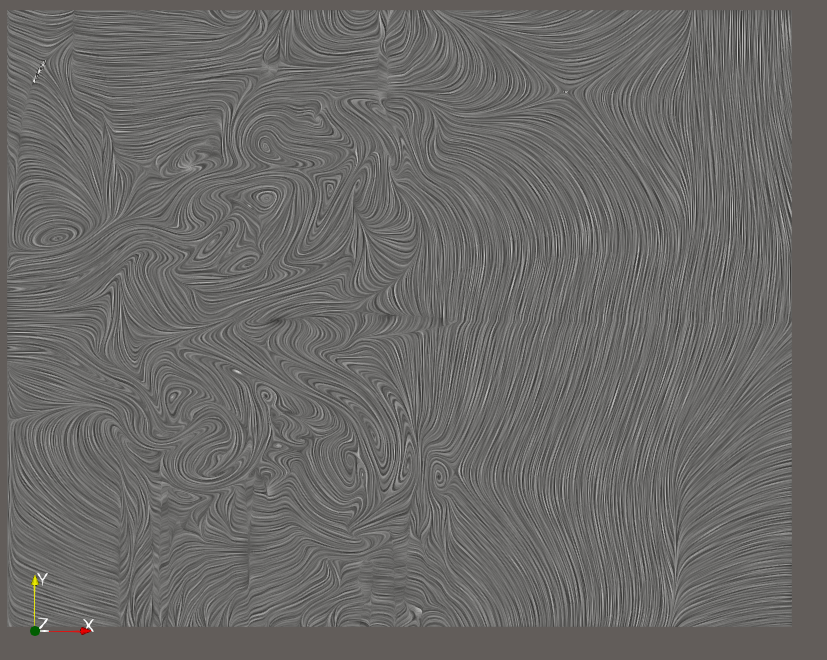
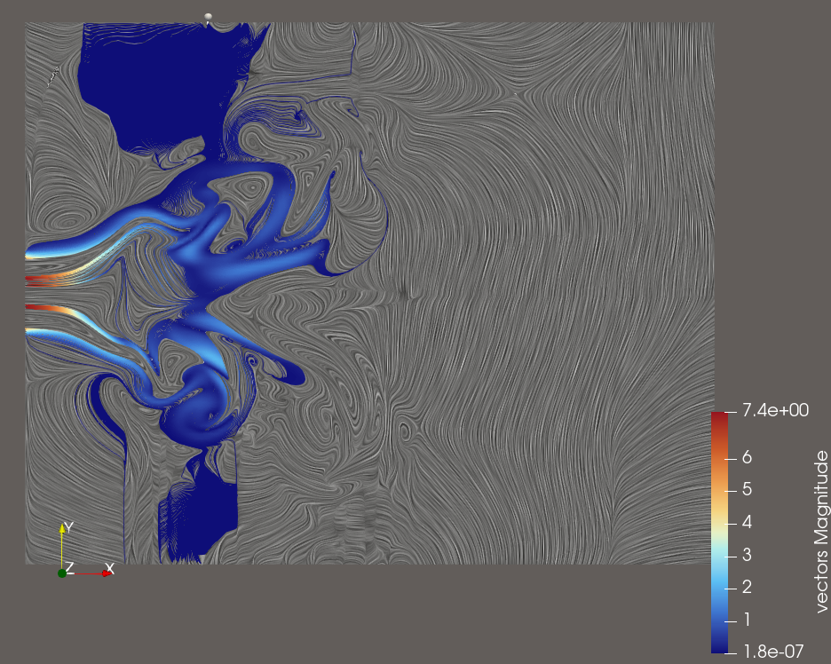
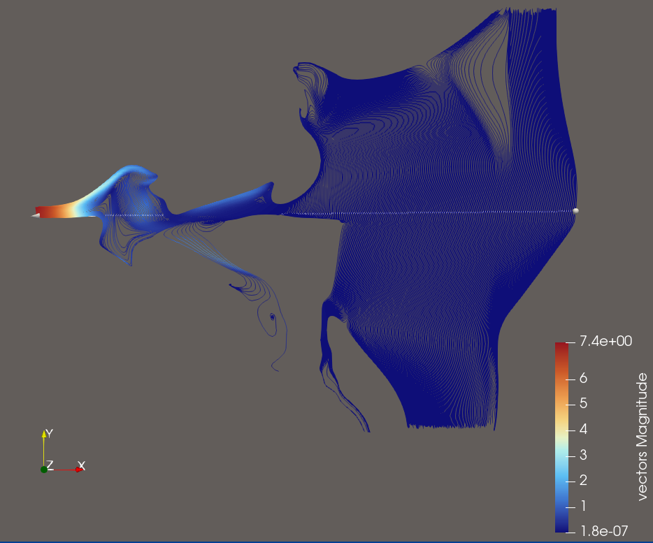

## Source:
    JetVelocity.vtk
## Ground Truth Visualisation

## Features:
- Two parts of the dataset, on the one hand vortex like flow on the left, and on the other regular flow on the right
- Show the different magnitude of vectors on the left side compared to the right side

## Explorative User Query for this Dataset

>**Visualization Goal:**
>    
>Visualize the flow of the field using Streamlines
>
>**Target Feature:**
>
>Explore the Datasets flow dynamics by using sufficient amounts of Streamlines. 

>**(Data dimension:)**
>    
>2D 
>
>**Data Type:**
>    
>
>**(Seeding behaviour:)**
>
>Choose the seeding behaviour based on the suggested seeding strategies, make sure to cover a lot of the Dataset to show different regions of flow
>
>**Density/Clutter**
>
>Make sure that you use enough streamlines to show the flow, but don't use too many that the view is cluttered
>
>**Constraints**
>
>Dont use Streamtubes and opacity, just use streamlines instead.
>
>**Notes:**
>
>Please also consider that you can use a colormap for better visual clarity.

## Feature Aware User Query for this Dataset

>**Visualization Goal:**
>    
>Visualize the flow of the field using Streamlines
>
>**Target Feature:**
>
>The dataset contains two distinct flow regions: a vortex-like flow in the lower x-region and a more regular flow in the higher x-region.
>Show the different magnitude of vectors on the left side compared to the right side

>**(Data dimension:)**
>    
>2D 
>
>**Data Type:**
>    
>
>**(Seeding behaviour:)**
>
>Choose the seeding behaviour based on the suggested seeding strategies, make sure to cover a lot of the Dataset to show different regions of flow
>
>**Density/Clutter**
>
>Make sure that you use enough streamlines to show the flow, but don't use too many that the view is cluttered
>
>**Constraints**
>
>Dont use Streamtubes and opacity, just use streamlines instead.
>
>**Notes:**
>
>Please also consider that you can use a colormap for better visual clarity.