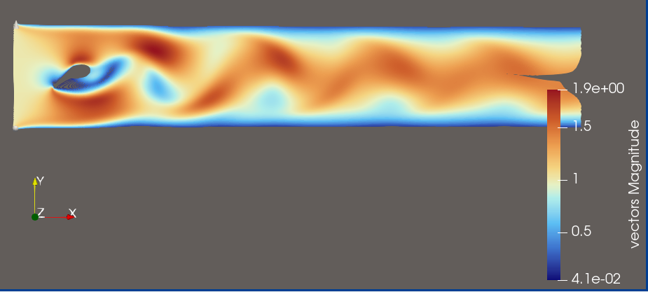
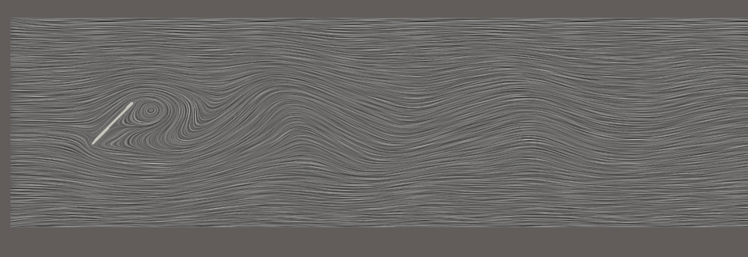

## Source:
    KarmanBalken2D.vtk
## Ground Truth Visualisation

## Features:
- Laminar Flow at low-x region
- Laminar Flow at regions without distruption
- Obstruction visualized
- Turbulent Flow after obstruction visible
- usage of colormap differentiates turbulent from laminar regions

## Explorative Query for this Dataset

>**Visualization Goal:**
>    
>Visualize the flow of the field using Streamlines
>
>**Target Feature:**
>
>Explore the dataset’s flow dynamics using a sufficient number of streamlines. The dataset contains an obstruction, and the visualization should clearly show how the flow behaves around it.
>
>
>**(Data dimension:)**
>    
>2D 
>
>**Data Type:**
>    
>**(Seeding behaviour:)**
>
>Choose the seeding behaviour based on the suggested seeding strategies
>
>**Density/Clutter**
>
>Make sure that you use enough streamlines to show the flow, but don't use too many that the view is cluttered
>
>**Constraints**
>
>Dont use Streamtubes and opacity, just use streamlines instead.
>
>**Notes:**
>
>Please also consider that you can use a colormap for better visual clarity.

## Feature Aware User Query for this Dataset

>**Visualization Goal:**
>    
>Visualize the flow of the field using Streamlines
>
>**Target Feature:**
>
>Visualize the dataset’s flow dynamics using a sufficient number of streamlines. The visualization should clearly show laminar flow in the low-x region as well as in regions that are not affected by disturbances. The obstruction in the flow field should be clearly visible, and the turbulent flow that develops downstream of the obstruction should also be recognizable. The chosen colormap should differentiate the turbulent flow regions from the regions with laminar flow.
>
>**(Data dimension:)**
>    
>2D 
>
>**Data Type:**
>    
>**(Seeding behaviour:)**
>
>Choose the seeding behaviour based on the suggested seeding strategies
>
>**Density/Clutter**
>
>Make sure that you use enough streamlines to show the flow, but don't use too many that the view is cluttered
>
>**Constraints**
>
>Dont use Streamtubes and opacity, just use streamlines instead.
>
>**Notes:**
>
>Please also consider that you can use a colormap for better visual clarity.
