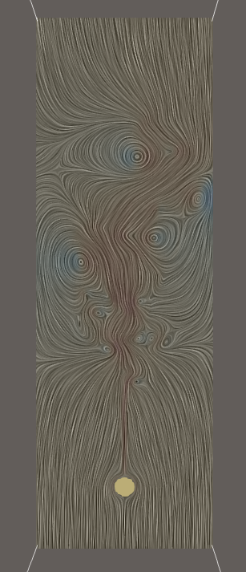
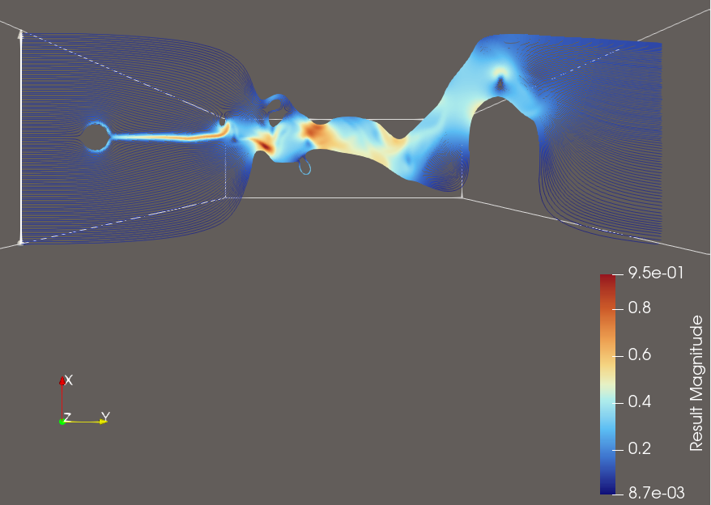

## Source:
    boussinesq2d.vti
## Ground Truth Visualisation

## Features:
- Flow around the solid block and irreglar flow at the end
- Showing different time slices
- Ability calculate the correct vectors from the unit vectors

## Explorative User Query for this Dataset

>**Visualization Goal:**
>    
    >Visualize the flow of the field using Streamlines
>
>**Target Feature:**
>
>Explore the Datasets flow dynamics by using sufficient amounts of Streamlines. Please also make sure to visualize several of the timesteps so that the difference in the flow can be observed
>
>**(Data dimension:)**
>    
>2D with time steps
>
>**Data Type:**
>    
>The z-Direction of the Data encodes different steps in time of the flow simulation. 
>
>**(Seeding behaviour:)**
>
>Choose the seeding behaviour based on the suggested seeding strategies
>
>**Density/Clutter**
>
>Make sure that you use enough streamlines to show the flow, but don't use too many that the view is cluttered
>
>**Constraints**
>
>Dont use Streamtubes and opacity, just use streamlines instead.
>
>**Notes:**
>
>You have to transform the data arrays by ther respective unit vectors first to get the actual vectors.
>Please also consider that you can use a colormap for better visual clarity.

## Feature Aware User Query for this Dataset

>**Visualization Goal:**
>    
    >Visualize the flow of the field using Streamlines
>
>**Target Feature:**
>
>Explore the Datasets flow dynamics by using sufficient amounts of Streamlines. Please also make sure to visualize several of the timesteps so that the difference in the flow can be observed. 
>- Show the flow Flow around the solid block and irreglar flow at the end
>- Showing different time slices
>
>**(Data dimension:)**
>    
>2D with time steps
>
>**Data Type:**
>    
>The z-Direction of the Data encodes different steps in time of the flow simulation. 
>
>**(Seeding behaviour:)**
>
>Choose the seeding behaviour based on the suggested seeding strategies
>
>**Density/Clutter**
>
>Make sure that you use enough streamlines to show the flow, but don't use too many that the view is cluttered
>
>**Constraints**
>
>Dont use Streamtubes and opacity, just use streamlines instead.
>
>**Notes:**
>
>You have to transform the data arrays by ther respective unit vectors first to get the actual vectors.
>Please also consider that you can use a colormap for better visual clarity.