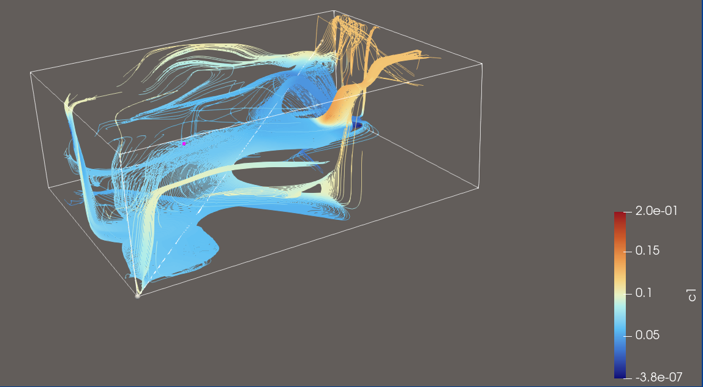
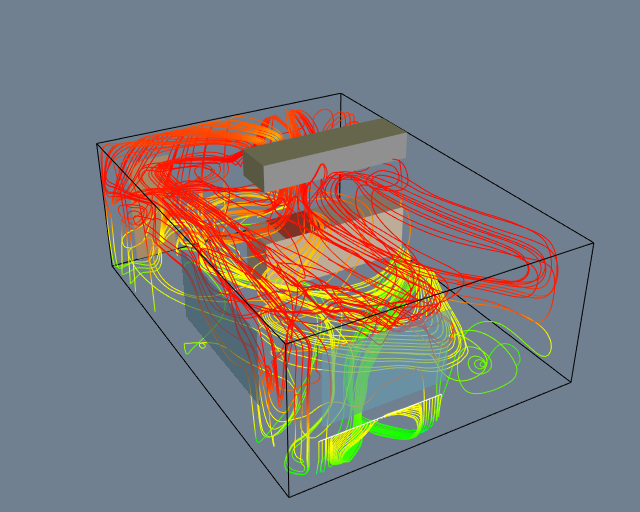

## Source:
    kitchen.vtk
## Ground Truth Visualisation

## Features:
- Flow towards vent
- lower magnitude flow at bottom
- good coverage of whole flow field

## Explorative Query for this Dataset

>**Visualization Goal:**
>    
>Visualize the flow of the field using Streamlines
>
>**Target Feature:**
>
>Explore the Datasets flow dynamics by using sufficient amounts of Streamlines. 
>
>
>**(Data dimension:)**
>    
>3D
>
>**Data Type:**
>    
>**(Seeding behaviour:)**
>
>Choose the seeding behaviour based on the suggested seeding strategies
>
>**Density/Clutter**
>
>Make sure that you use enough streamlines to show the flow, but don't use too many that the view is cluttered
>
>**Constraints**
>
>Dont use Streamtubes and opacity, just use streamlines instead.
>
>**Notes:**
>
>Please also consider that you can use a colormap for better visual clarity.

## Feature Aware Query for this Dataset

>**Visualization Goal:**
>    
>Visualize the flow of the field using Streamlines
>
>**Target Feature:**
>
>Explore the dataset’s flow dynamics using a sufficient number of streamlines. The data represents airflow in a kitchen with a vent, and the visualization should clearly show how the air moves through the space and where it is being directed. 
>
>
>**(Data dimension:)**
>    
>3D
>
>**Data Type:**
>Synthetic Data from the vtk examples.    
>**(Seeding behaviour:)**
>
>Choose the seeding behaviour based on the suggested seeding strategies
>
>**Density/Clutter**
>
>Make sure that you use enough streamlines to show the flow, but don't use too many that the view is cluttered
>
>**Constraints**
>
>Dont use Streamtubes and opacity, just use streamlines instead.
>
>**Notes:**
>
>Please also consider that you can use a colormap for better visual clarity.