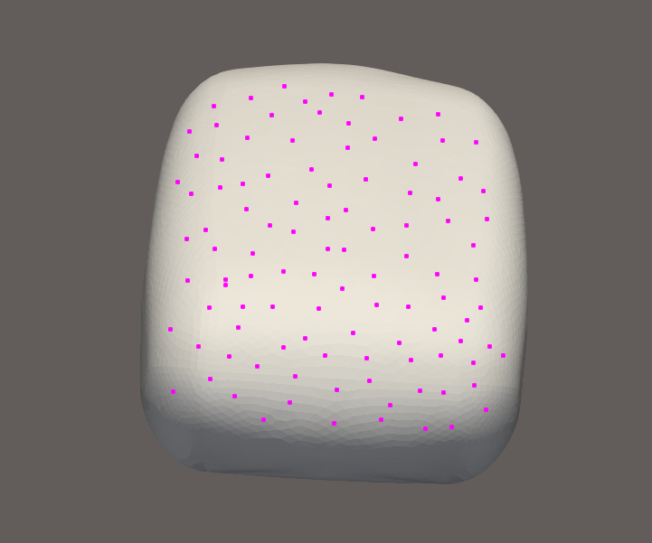
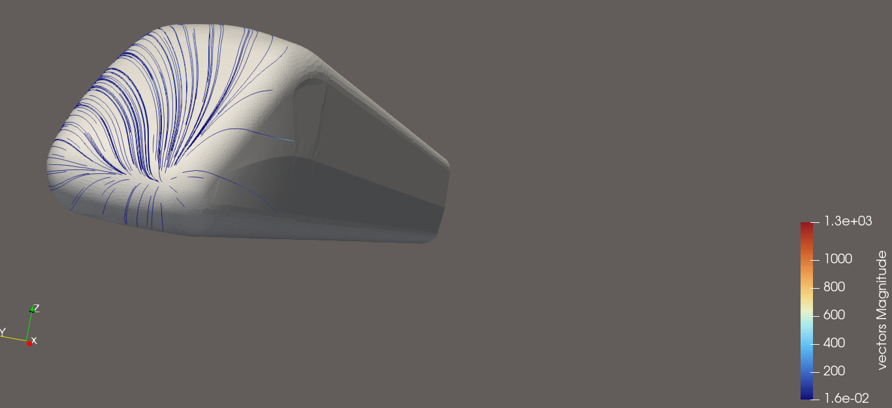
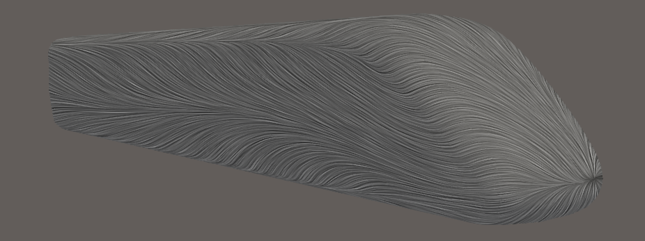

## Source:
    markPosVector.vtk
## Ground Truth Visualisation

## Features:
- Flow source at bottom right of model
- Surface flow of the whole model
- Show the solid grid correctly
- Color the streamlines with a fitting colormap

## Explorative User Query for this Dataset

**Visualization Goal:**
    
>Visualize the flow of on top of the surface of the train
>
>**Target Feature:**
>
>Explore the Datasets flow dynamics by using sufficient amounts of Streamlines. 
>
>
>**(Data dimension:)**
>    
>3D
>
>**Data Type:**
>
>All of the flow originates from the surface of the model.
>
>**(Seeding behaviour:)**
>
>Choose the seeding behaviour based on the suggested seeding strategies
>
>**Density/Clutter**
>
>Make sure that you use enough streamlines to show the flow, but don't use too many that the view is cluttered
>
>**Constraints**
>
>Dont use Streamtubes and opacity, just use streamlines instead.
>
>**Notes:**
>
>Please also consider that you can use a colormap for better visual clarity.

## Feature Aware User Query for this Dataset

**Visualization Goal:**
    
>Visualize the flow of on top of the surface of the train
>
>**Target Feature:**
>
>Explore the dataset’s flow dynamics using a sufficient number of streamlines. The data represents surface flow over a train model, so the visualization should clearly show the flow across the entire surface of the model. Make sure the flow source at the bottom right of the model is visible, and ensure that the solid geometry or surface grid of the train is displayed correctly.
>
>**(Data dimension:)**
>    
>3D
>
>**Data Type:**
>
>All of the flow originates from the surface of the model.
>
>**(Seeding behaviour:)**
>
>Choose the seeding behaviour based on the suggested seeding strategies
>
>**Density/Clutter**
>
>Make sure that you use enough streamlines to show the flow, but don't use too many that the view is cluttered
>
>**Constraints**
>
>Dont use Streamtubes and opacity, just use streamlines instead.
>
>**Notes:**
>
>Please also consider that you can use a colormap for better visual clarity. Make sure that the streamlines are rendered on top of the solid mesh.