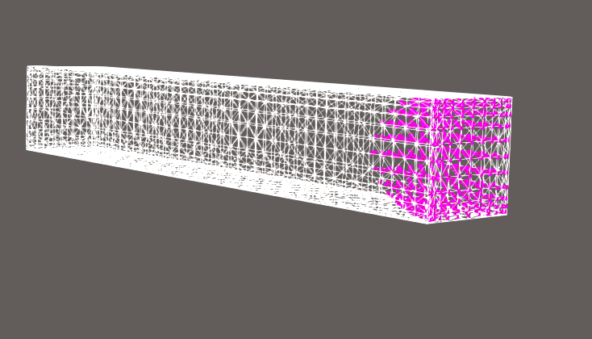
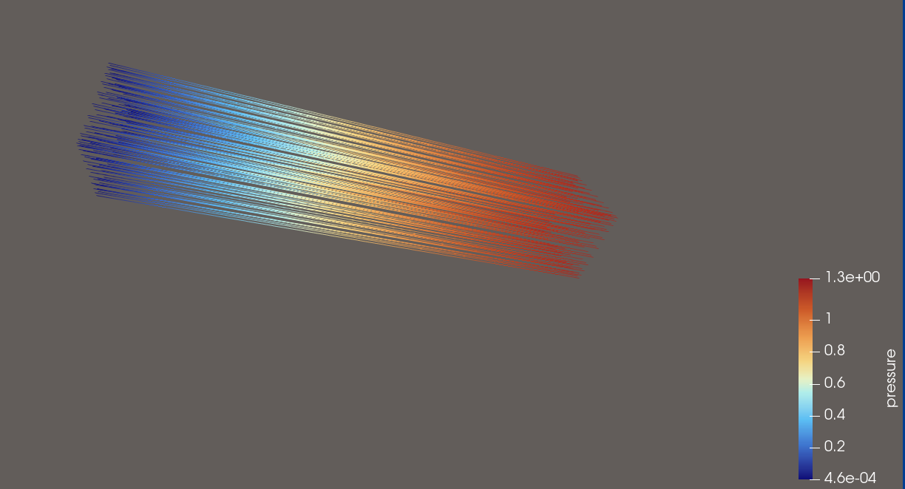

## Source:
    mesh_smag_0040.md
## Ground Truth Visualisation

## Features:
- Coloring
- Streamlines drawn correctly

## User Query for this Dataset

**Visualization Goal:**
    
Visualize the flow of on top of the surface of the train

**Target Feature:**

Explore the Datasets flow dynamics by using sufficient amounts of Streamlines. The Data is of the model of a train and the flow is on top of the surface

**(Data dimension:)**
    
3D

**Data Type:**

All of the flow originates from the surface of the model.

**(Seeding behaviour:)**

Choose the seeding behaviour based on the suggested seeding strategies

**Density/Clutter**

Make sure that you use enough streamlines to show the flow, but don't use too many that the view is cluttered

**Constraints**

Dont use Streamtubes and opacity, just use streamlines instead.

**Notes:**

Please also consider that you can use a colormap for better visual clarity.
