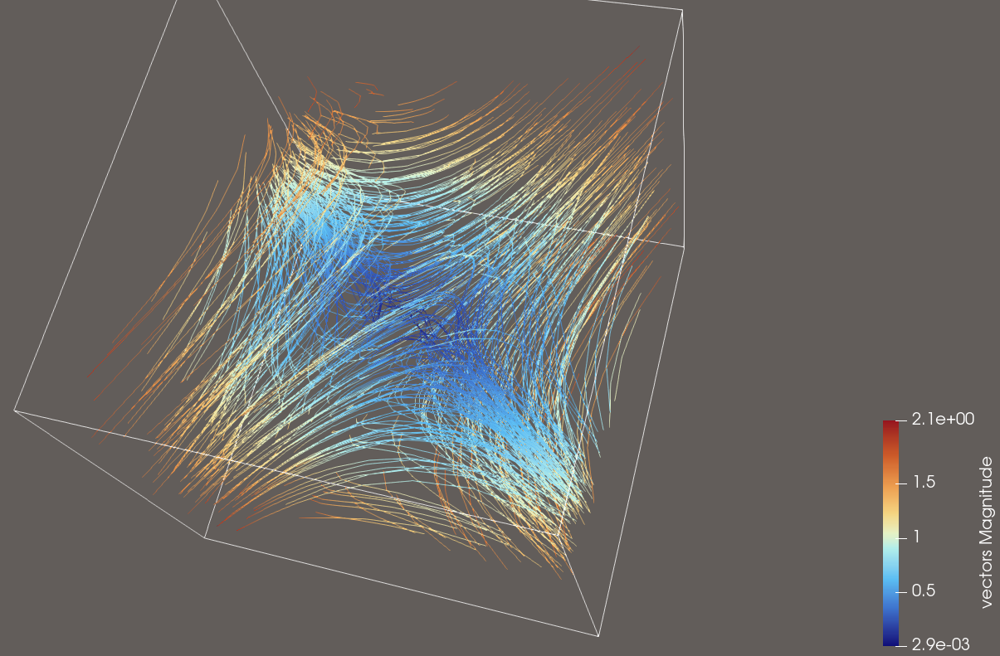
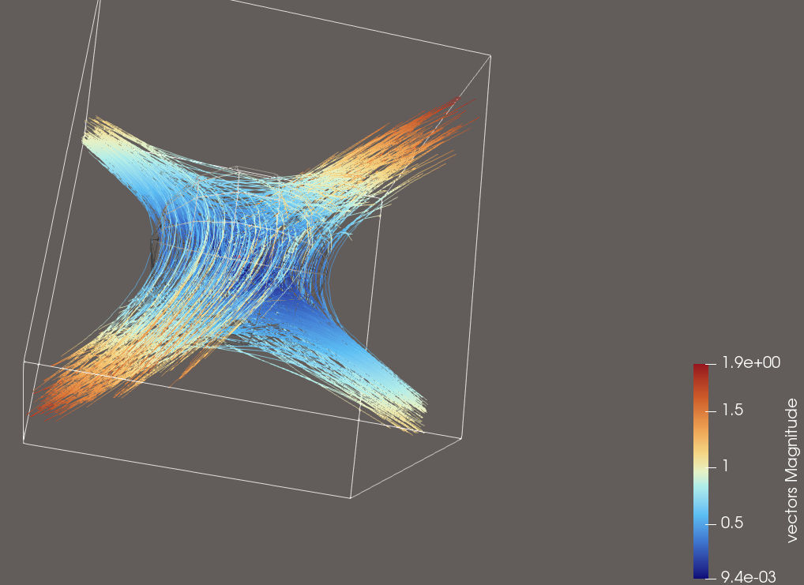
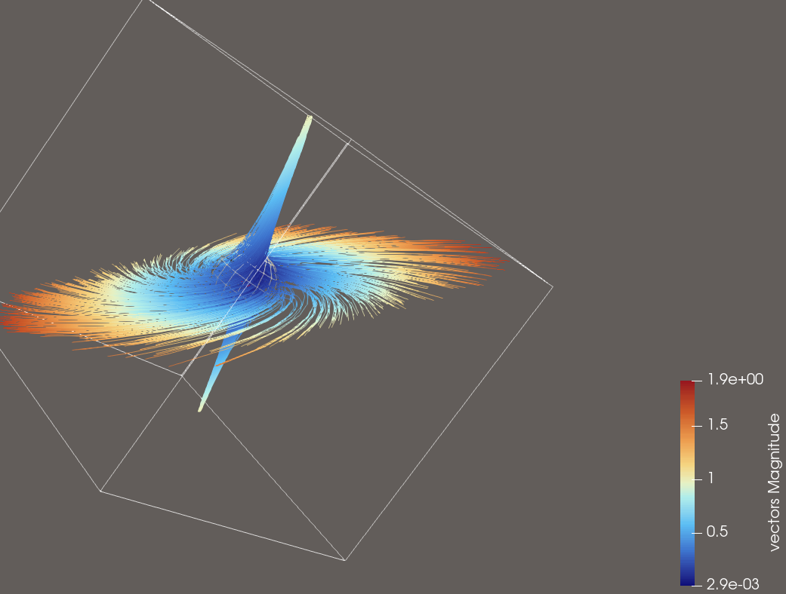

## Source:
    streamTest1.vtk
## Ground Truth Visualisation

## Features:
- General flow overview of Dataset
- Vortex diagonal to the Domain
- Flow velocity differentiation, velocity magnitude decreases the farther the streamline travels towards the bounds
- Correct use of colormap

>## Explorative User Query for this Dataset
>
>**Visualization Goal:**
>    
>Visualize the flow of the vector field
>
>**Target Feature:**
>
>Explore the Datasets flow dynamics by using sufficient amounts of Streamlines.
>
>
>**(Data dimension:)**
>    
>3D
>
>**Data Type:**
>
>
>
>**(Seeding behaviour:)**
>
>Choose the seeding behaviour based on the suggested seeding strategies
>
>**Density/Clutter**
>
>Make sure that you use enough streamlines to show the flow, but don't use too many that the view is cluttered
>
>**Constraints**
>
>Dont use Streamtubes and opacity, just use streamlines instead.
>
>**Notes:**
>
>Please also consider that you can use a colormap for better visual clarity.

>## Feature Aware User Query for this Dataset
>
>**Visualization Goal:**
>    
>Visualize the flow of the vector field
>
>**Target Feature:**
>
> Visualize the vortex at the center of the domain. The streamlines should exhibit a planar, diagonal divergence, while along the orthogonal direction they converge.
>
>
>**(Data dimension:)**
>    
>3D
>
>**Data Type:**
>
>This is a synthetic Dataset which shows a vortex in the middle
>
>**(Seeding behaviour:)**
>
>Choose the seeding behaviour based on the suggested seeding strategies
>
>**Density/Clutter**
>
>Make sure that you use enough streamlines to show the flow, but don't use too many that the view is cluttered
>
>**Constraints**
>
>Dont use Streamtubes and opacity, just use streamlines instead.
>
>**Notes:**
>
>Please also consider that you can use a colormap for better visual clarity.
