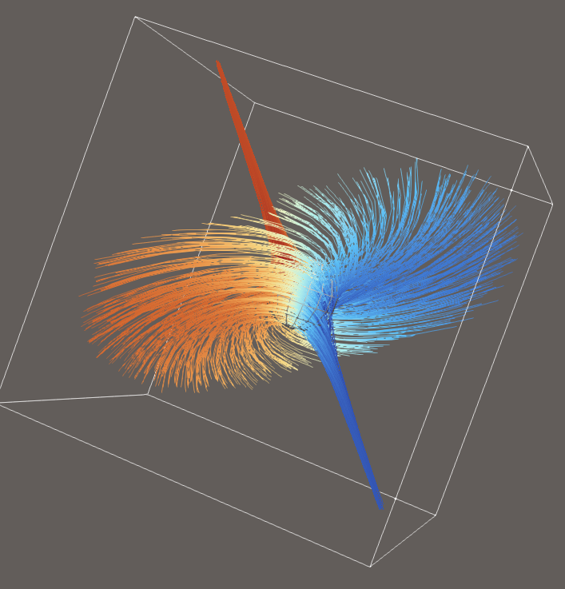
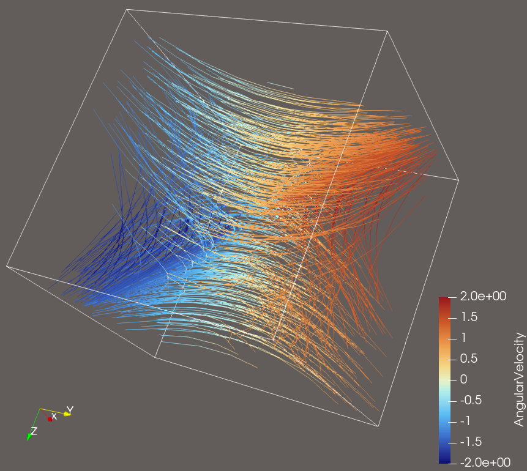

## Source:
    streamTest1.vtk
## Ground Truth Visualisation

## Features:
- Flow direction and flow Plane, vortices 
- Flow velocity differentiation, flow with high velocity in one area and with low in different area

