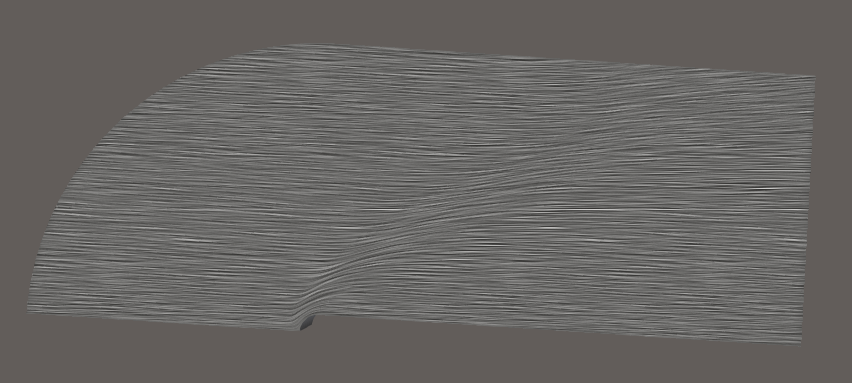
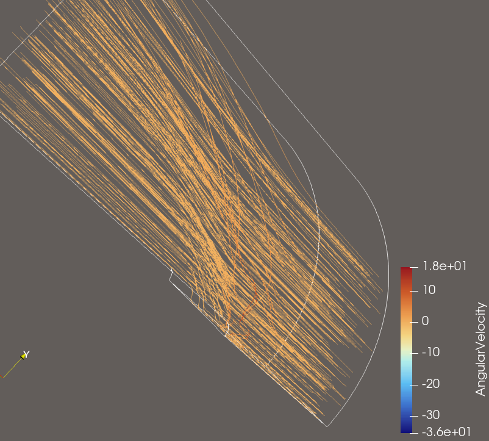
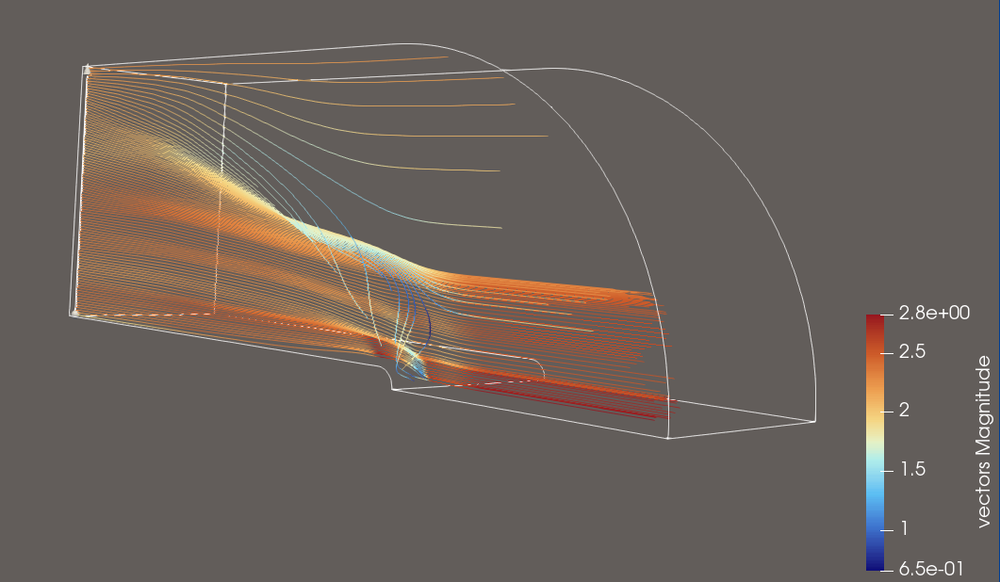

## Source:
    streamTest1.vtk
## Ground Truth Visualisation

## Features:
- turbulent flow at z-Border of Domain
- drop of streamlines at domain curve
- laminar flow inside the grid
- colormap represents velocity

## Explorative User Query for this Dataset

>**Visualization Goal:**
>
>
>Visualize the flow of the vector field
>
>**Target Feature:**
>
>Explore the Datasets flow dynamics by using sufficient amounts of Streamlines.
>
>
>**(Data dimension:)**
>    
>3D
>
>**Data Type:**
>
>
>
>**(Seeding behaviour:)**
>
>Choose the seeding behaviour based on the suggested seeding strategies
>
>**Density/Clutter**
>
>Make sure that you use enough streamlines to show the flow, but don't use too many that the view is cluttered
>
>**Constraints**
>
>Dont use Streamtubes and opacity, just use streamlines instead.
>
>**Notes:**
>
>Please also consider that you can use a colormap for better visual clarity.

## Feature Aware User Query
>
>**Visualization Goal:**
>    
>Visualize the flow of the vector field
>
>**Target Feature:**
>
>The turbulence of interest is located near the boundary of the dataset in the positive (z)-direction. 
>The general flow pattern of the field is also important, so the visualization should capture the overall flow dynamics in addition to the specific features of interest.
>**(Data dimension:)**
>    
>3D
>
>**Data Type:**
>
>
>
>**(Seeding behaviour:)**
>
>Choose the seeding behaviour based on the suggested seeding strategies
>
>**Density/Clutter**
>
>Make sure that you use enough streamlines to show the flow, but don't use too many that the view is cluttered
>
>**Constraints**
>
>Dont use Streamtubes and opacity, just use streamlines instead.
>
>**Notes:**
>
>Please also consider that you can use a colormap for better visual clarity. The domain is curved, make sure the seed points are located inside the domain. 