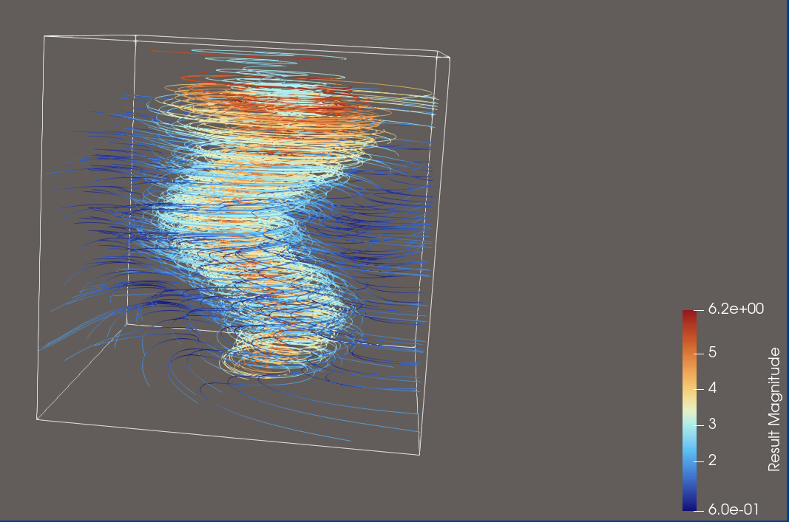

## Source:
    tornado3d.vti
## Ground Truth Visualisation

## Features:
- Show the whole tornado
- Good spacing across whole domain
- Correctly calculate the vectors by multiplying with the respective unit vectors
- Color by magnitude and choose colormap correctly

>## Explorative Query for this Dataset
>
>**Visualization Goal:**
>    
>Visualize the dataset’s flow using a sufficient number of streamlines to clearly represent the structure without cluttering or obscuring the view. Use an appropriate colormap based on vector magnitude to convey flow intensity.
>
>**Target Feature:**
>
>Explore the Datasets flow dynamics by using sufficient amounts of Streamlines.
>
>
>**(Data dimension:)**
>    
>3D
>
>**Data Type:**
>You have to transform the input arrays by their respective unit vectors to get the actual vectors for a streamline visualisation
>
>**(Seeding behaviour:)**
>
>Choose the seeding behaviour based on the suggested seeding strategies
>
>**Density/Clutter**
>
>Make sure that you use enough streamlines to show the flow, but don't use too many that the view is cluttered
>
>**Constraints**
>
>Dont use Streamtubes and opacity, just use streamlines instead.
>
>**Notes:**
>
>Please also consider that you can use a colormap for better visual clarity.

>## Feature Aware Query for this Dataset
>
>**Visualization Goal:**
>    
>Visualize the dataset’s flow using a sufficient number of streamlines to clearly represent the structure without cluttering or obscuring the view. Use an appropriate colormap based on vector magnitude to convey flow intensity. 
>
>**Target Feature:**
>
>Explore the dataset’s flow dynamics using a sufficient number of streamlines. The dataset contains a tornado-like structure, and it is important that the entire feature is visualized. Therefore, ensure that most of the domain is represented so the full flow field and the complete tornado structure can be seen clearly.
>
>
>**(Data dimension:)**
>    
>3D
>
>**Data Type:**
>
>You have to transform the input arrays by their respective unit vectors to get the actual vectors for a streamline visualisation
>
>**(Seeding behaviour:)**
>
>Choose the seeding behaviour based on the suggested seeding strategies
>
>**Density/Clutter**
>
>Make sure that you use enough streamlines to show the flow, but don't use too many that the view is cluttered
>
>**Constraints**
>
>Dont use Streamtubes and opacity, just use streamlines instead.
>
>**Notes:**
>
>Please also consider that you can use a colormap for better visual clarity.

